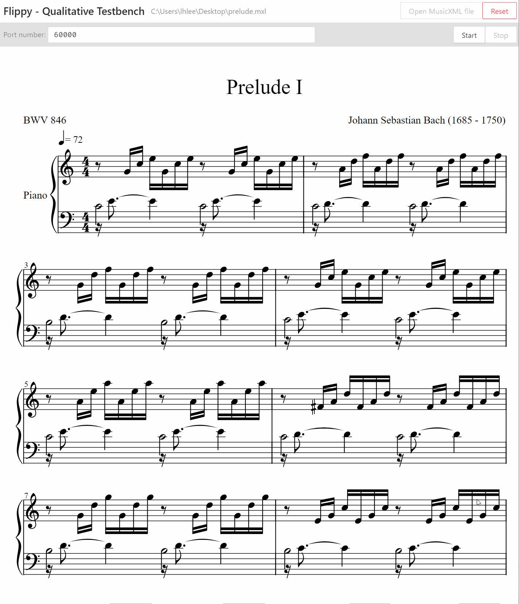
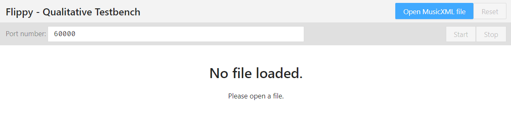
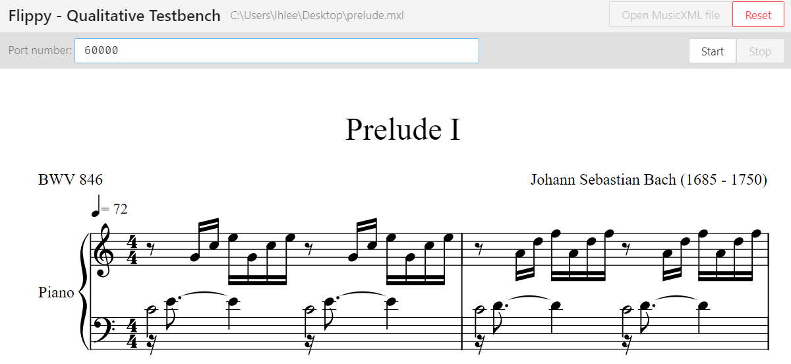

# Flippy Qualitative Testbench

Score-follower qualitative testbench.

Displays the timestamp output by a score-follower as a cursor on the score.



## Installation

Pre-built installers for Mac, Windows and Linux are available in [Releases](https://github.com/flippy-fyp/flippy-qualitative-testbench/releases).

If you wish to build (and package) this app yourself, see the Building and Packaging sections below.

## Usage Guide

### Requirements
- Score in MusicXML format.
- Score-follower capable of outputting score timestamps (both integers or floats are OK) via UDP packets.
  - See [`src/test/mockfollower/mockfollower.py`](src/test/mockfollower/mockfollower.py) for a mock follower in Python fulfilling this requirement.
  - See https://github.com/flippy-fyp/flippy for a score-follower supporting this application.

### Usage

- Click the blue "Open MusicXML File" button to load your MusicXML score.
  

- Specify the port number that your score-follower will send timestamp packets; then, press "Start".
  

- Make sure your score-follower outputs timestamps to the right address and port number, then run the score-follower.
  - As an example, `python src/test/mockfollower/mockfollower.py` outputs timestamps to `127.0.0.1:60000` (`localhost:60000`).
### Other Features
- Score zooming is available via `Cmd`/`Ctrl` + Mousewheel(Up/Down)
- `Cmd`/`Ctrl`+`R` triggers a refresh.
## Development Setup

- Install dependencies

```bash
npm install
```

- Run these two commands in separate terminals.

```bash
npm run dev:react
npm run dev:electron
```

- Run tests
```bash
npm test
```

- Lint
```bash
npm run lint
```

## Building

```bash
npm run build
```

## Packaging

```bash
npm run dist
```

## More Information

* Detailed documentation and implementation details can be found in the [project report](https://arxiv.org/abs/2205.03247).

## Contributing

* File bugs and/or feature requests in the [GitHub repository](https://github.com/flippy/flippy-qualitative-testbench)
* Pull requests are welcome in the [GitHub repository](https://github.com/flippy/flippy-qualitative-testbench)
* Buy me a Coffee ☕️ via [PayPal](https://paypal.me/lhl2617)

## Citing

### BibTeX
```
@misc{https://doi.org/10.48550/arxiv.2205.03247,
  doi = {10.48550/ARXIV.2205.03247},
  url = {https://arxiv.org/abs/2205.03247},
  author = {Lee, Lin Hao},
  keywords = {Sound (cs.SD), Audio and Speech Processing (eess.AS), FOS: Computer and information sciences, FOS: Computer and information sciences, FOS: Electrical engineering, electronic engineering, information engineering, FOS: Electrical engineering, electronic engineering, information engineering},
  title = {Musical Score Following and Audio Alignment},
  publisher = {arXiv},
  year = {2022},
  copyright = {Creative Commons Attribution 4.0 International}
}
```
